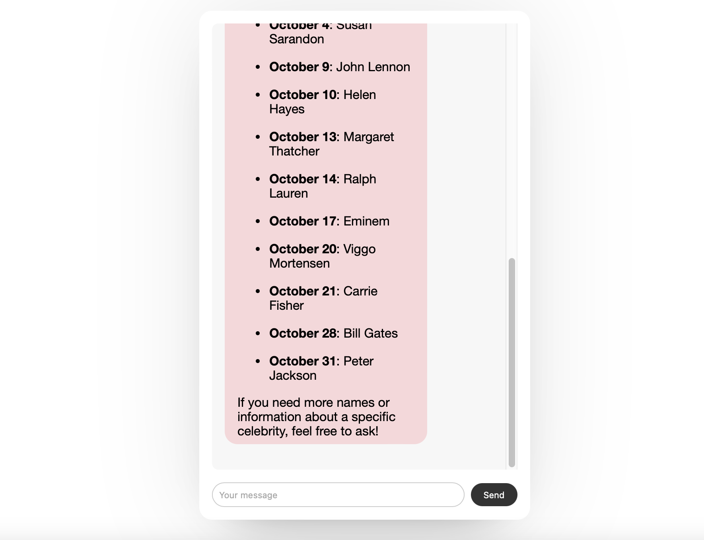

# Chatbot

This is a simple chatbot project that utilizes the OpenAI API to provide users with an interactive conversational experience. It consists of a web application, a mobile application for iOS and Android, and a backend API written in Go.

## Architecture

- **Web Application**: Built using HTML, CSS, and JavaScript.
- **Mobile Application**: A Flutter-based mobile app for both iOS and Android, developed using Dart, ensuring cross-platform compatibility.
- **Backend API**: An API built with Go to handle requests to the OpenAI API and send responses to the web and mobile applications.

## Features

- **User Interfaces**: Interactive user interfaces for both web and mobile platforms.  These interfaces support Markdown, which is automatically converted to HTML when displayed.
- **API Integration**: Communication with the OpenAI API to generate intelligent responses in context conversation.
- **Cross-Platform**: Supports both web and mobile platforms, allowing users to access the chatbot from various devices.

## Requirements

- **Go**: Required for the backend.
- **Flutter**: Required for the mobile application development.
- **OpenAI API Key**: You need an API key from OpenAI to interact with the API, set as an environment variable:
  OPENAI_API_KEY="your-api-key"

## Screenshots

### Mobile View / Web  View

